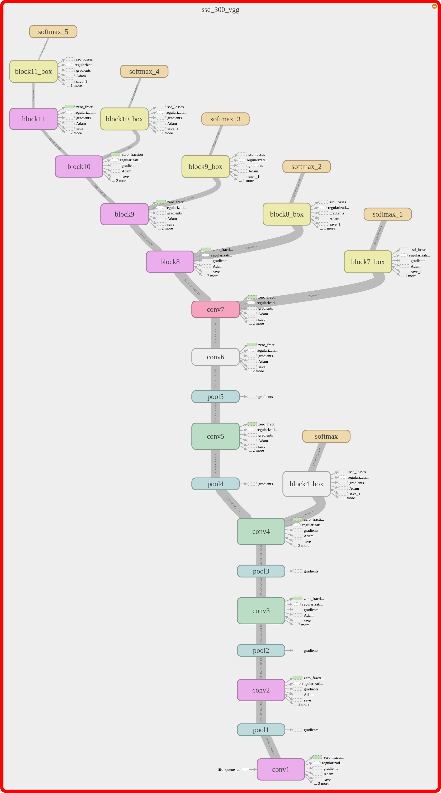
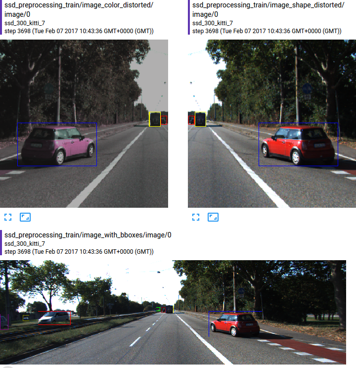
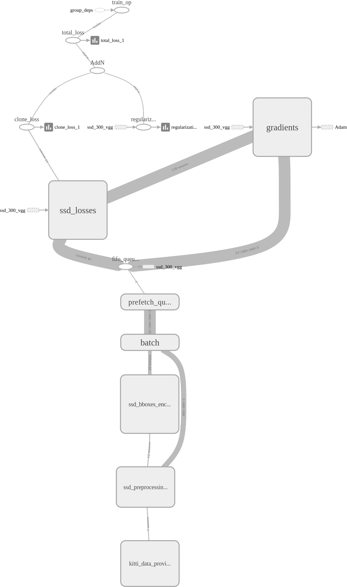
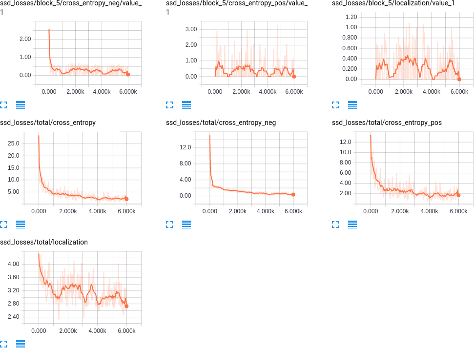

# Udacity SDC: Vehicle Detection

The goad of this project is to implement a robust pipeline capable of detecting moving vehicles in real-time. Even though the project was designed for using classic Computer Vision techniques, namely HOG features and SVM classifier, in agreement the course organizers, I decided like a few other students to go for a deep learning approach.

Several important papers on object detection using deep convolutional networks have been published the last few years. More specifically, [Faster R-CNN](https://arxiv.org/abs/1506.01497), [YOLO](https://arxiv.org/abs/1612.08242) and [Single Shot MultiBox Detector](https://arxiv.org/abs/1512.02325) are the present state-of-the-art in using CNN for real-time object detection.

Even though there are a few differences between the three previous approaches, they share the same general pipeline. Namely, the detection network is designed based on the following rules:
* Use a deep convolutional network trained on ImageNet as a multi-scale source of features. Typically, VGG, ResNet or Inception;
* Provide a collection of pre-defined *anchors boxes* tiling the image at different positions and scales. They serve the same purpose as the sliding window approach in classic CV detection algorithms;
* For every anchor box, the modified CNN provides a probability for every class of object (and a no detection probability), and offsets (x, y, width and height) between the detected box and the associated anchor box.
* The detection output of the network is post-processed using a Non-Maximum Selection algorithm, in order to remove overlapping boxes.

For this project, I decided to implement the SSD detector, as the later provides a good compromise between accuracy and speed (note that the last YOLOv2 article describes in fact a SSD-like network).

# SSD: Single Shot MultiBox Detector for vehicle detection

The author of the original SSD research paper had implemented [SSD using the framework Caffe](https://github.com/weiliu89/caffe/tree/ssd). As I could not find any satisfying TensorFlow implementation of the former, I decided to write my own from scratch. This task was more time-consuming than I had originally thought, but also allowed me to learn how to properly write a large TensorFlow pipeline, from TFRecords to TensorBoard! I left my pure SSD port in a different [GitHub repository](https://github.com/balancap/SSD-Tensorflow), and modified it for this vehicle detection project.

## SSD architecture

As previously outlined, the SSD network used the concept of anchor boxes for object detection. The image below illustrates the concept: at several scales are pre-defined boxes with different sizes and ratios. The goal of SSD convolutional network is, for each of these anchor boxes, to detect if there is an object inside this box (or closely), and compute the offset between the object bounding box and the fixed anchor box.


In the case of SSD network, we use VGG as a based architecture: it provides high quality features at different scales, the former being then used as inputs for *multibox* modules in charge of computing the object type and coordinates for each anchor boxes. The architecture of the network we use is illustrated in the following TensorBoard graph. It follows the original SSD paper:
* Convolutional Blocks 1 to 7 are exactly VGG modules. Hence, these weights can be imported from VGG weights, speeding massively training time;
* Blocks 8 to 11 are additional feature blocks. They consist of two convolutional layers each: a 3x3 convolution followed by a 1x1 convolution;
* Yellow blocks are *multibox* modules: they take VGG-type features as inputs, and outputs two components: a softmax Tensor which gives for every anchor box the probability of an object being detected, and an offset Tensor which describes the offset between the object bounding box and the anchor box. These two Tensors are the results of two different 3x3 convolutions of the input Tensor.

For instance, consider the 8x8 feature block described in the image above. At every coordinate in the grid, it defines 4 anchor boxes of different dimensions. The *multibox* module taking this feature Tensor as input will thus provide two output Tensors: a classification Tensor of shape 8x8x4xNClasses and an offset Tensor of shape 8x8x4x4, where in the latter, the last dimension stands for the 4 coordinates of every bounding box.

As a result, the global SSD network will provide a classification score and an offset for a total of 8732 anchor boxes. During training, we therefore try to minimize both errors: the classification error on every anchor box and the localization error when there is a positive match with a grountruth bounding box. We refer to the original SSD paper for the precise equations defining the loss function.



## SSD in TensorFlow

Porting the SSD network to TensorFlow has been a worthy but ambitious project on its own! Designing a robust pipeline in TensorFlow requires quite a bit of engineering, and debugging, especially in the case of object detection networks.
For this SSD pipeline, I took inspiration from the implementation of common deep CNNs in TF-Slim (https://github.com/tensorflow/models/tree/master/slim). Basically, the pipeline is divided into three main components (and directories):
* ```datasets```: the Python source files implement the interface for different dataset, and describe how to convert the original raw data into *TFRecords* files. In our case, as we use the KITTI dataset, the file ```kitti_to_tfrecords.py``` performs this convertion, and the files ```kitti.py``` and ```kitti_common.py``` implements the interface, in the form of TF-Slim dataset object. Note that we also left the source files describing the Pascal VOC dataset, in case we would like to combine the latter with the KITTI dataset.
* ```preprocessing```: this directory contains the implementation of the pre-processing before training (or evaluation). More specifically, we described our pipeline in the file ```ssd_vgg_preprocessing.py```. During training, our pre-processing pipeline performs three different important random transformations:
    * random cropping: a zone containing objects is randomly generated and used for cropping the input image;
    * random flipping: the image is randomly left-right flipped;
    * random color distortions: we randomly distort the saturation, hue, contrast and brightness of the images.
Note that the implementation of these random pre-processing steps are inspired by the TensorFlow pre-processing pipeline of the Inception network. In short, the previous steps correspond to the following code:
```python
# Crop and distort image and bounding boxes.
dst_image, labels, bboxes, distort_bbox = \
    distorted_bounding_box_crop(image, labels, bboxes,
                                aspect_ratio_range=CROP_RATIO_RANGE)
# Resize image to output size.
dst_image = tf_image.resize_image(dst_image, out_shape,
                                  method=tf.image.ResizeMethod.BILINEAR)
# Randomly flip the image horizontally.
dst_image, bboxes = tf_image.random_flip_left_right(dst_image, bboxes)
# Randomly distort the colors. There are 4 ways to do it.
dst_image = apply_with_random_selector(
        dst_image,
        lambda x, ordering: distort_color(x, ordering, fast_mode),
        num_cases=4)
# Rescale to VGG input scale.
image = dst_image * 255.
image = tf_image_whitened(image, [_R_MEAN, _G_MEAN, _B_MEAN])
return image, labels, bboxes
```
The following image presents the result the pre-processing on an image.


* ```nets```: the last important piece in this puzzle gathers the definition of the SSD network. For that purpose, we used the TF-slim library, which is a simpler interface provided in TensorFlow. It allows to define very simply and in a very lines a deep network. In our case, the SSD network described above is implemented the source file ```ssd_vgg_300.py``` and only consists of the following few lines:
```python
feat_layers=['block4', 'block7', 'block8', 'block9', 'block10', 'block11'],

def ssd_multibox_layer(inputs, num_classes,
                       sizes, ratios=[1],
                       normalization=-1):
    """Construct a multibox layer, return class and localization predictions Tensors.
    """
    net = inputs
    if normalization > 0:
        net = custom_layers.l2_normalization(net, scaling=True)
    # Number of anchors.
    num_anchors = len(sizes) + len(ratios)
    # Localization.
    num_loc_pred = num_anchors * 4
    loc_pred = slim.conv2d(net, num_loc_pred, [3, 3], scope='conv_loc')
    loc_pred = tf.reshape(loc_pred,
                          tensor_shape(loc_pred, 4)[:-1]+[num_anchors, 4])
    # Class prediction.
    num_cls_pred = num_anchors * num_classes
    cls_pred = slim.conv2d(net, num_cls_pred, [3, 3], scope='conv_cls')
    cls_pred = tf.reshape(cls_pred,
                          tensor_shape(cls_pred, 4)[:-1]+[num_anchors, num_classes])
    return cls_pred, loc_pred

def ssd_net(inputs, num_classes,
            feat_layers, anchor_sizes, anchor_ratios,
            normalizations,
            is_training=True,
            prediction_fn=slim.softmax,
            reuse=None,
            scope='ssd_300_vgg'):
    """SSD net definition.
    """
    # End_points collect relevant activations for external use.
    end_points = {}
    with tf.variable_scope(scope, 'ssd_300_vgg', [inputs], reuse=reuse):
        # Original VGG-16 blocks.
        net = slim.repeat(inputs, 2, slim.conv2d, 64, [3, 3], scope='conv1')
        end_points['block1'] = net
        net = slim.max_pool2d(net, [2, 2], scope='pool1')
        # Block 2.
        net = slim.repeat(net, 2, slim.conv2d, 128, [3, 3], scope='conv2')
        end_points['block2'] = net
        net = slim.max_pool2d(net, [2, 2], scope='pool2')
        # Block 3.
        net = slim.repeat(net, 3, slim.conv2d, 256, [3, 3], scope='conv3')
        end_points['block3'] = net
        net = slim.max_pool2d(net, [2, 2], scope='pool3')
        # Block 4.
        net = slim.repeat(net, 3, slim.conv2d, 512, [3, 3], scope='conv4')
        end_points['block4'] = net
        net = slim.max_pool2d(net, [2, 2], scope='pool4')
        # Block 5.
        net = slim.repeat(net, 3, slim.conv2d, 512, [3, 3], scope='conv5')
        end_points['block5'] = net
        net = slim.max_pool2d(net, [3, 3], 1, scope='pool5')
        # Block 6: let's dilate the hell out of it!
        net = slim.conv2d(net, 1024, [3, 3], rate=6, scope='conv6')
        end_points['block6'] = net
        # Block 7: 1x1 conv. Because the fuck.
        net = slim.conv2d(net, 1024, [1, 1], scope='conv7')
        end_points['block7'] = net

        # Block 8/9/10/11: 1x1 and 3x3 convolutions stride 2 (except lasts).
        end_point = 'block8'
        with tf.variable_scope(end_point):
            net = slim.conv2d(net, 256, [1, 1], scope='conv1x1')
            net = slim.conv2d(net, 512, [3, 3], stride=2, scope='conv3x3')
        end_points[end_point] = net
        end_point = 'block9'
        with tf.variable_scope(end_point):
            net = slim.conv2d(net, 128, [1, 1], scope='conv1x1')
            net = slim.conv2d(net, 256, [3, 3], stride=2, scope='conv3x3')
        end_points[end_point] = net
        end_point = 'block10'
        with tf.variable_scope(end_point):
            net = slim.conv2d(net, 128, [1, 1], scope='conv1x1')
            net = slim.conv2d(net, 256, [3, 3], scope='conv3x3', padding='VALID')
        end_points[end_point] = net
        end_point = 'block11'
        with tf.variable_scope(end_point):
            net = slim.conv2d(net, 128, [1, 1], scope='conv1x1')
            net = slim.conv2d(net, 256, [3, 3], scope='conv3x3', padding='VALID')
        end_points[end_point] = net

        # Prediction and localisations layers.
        predictions = []
        logits = []
        localisations = []
        for i, layer in enumerate(feat_layers):
            with tf.variable_scope(layer + '_box'):
                p, l = ssd_multibox_layer(end_points[layer],
                                          num_classes,
                                          anchor_sizes[i],
                                          anchor_ratios[i],
                                          normalizations[i])
            predictions.append(prediction_fn(p))
            logits.append(p)
            localisations.append(l)

        return predictions, localisations, logits, end_points
```
The ```nets``` directory contains a few more important methods necessary to the SSD network. The complex loss function, combining classification and localization losses is implemented in the file ```ssd_vgg_300.py``` as the method ```ssd_losses```. The source file ```ssd_common.py``` contains multiple functions related to bounding boxes computations (jaccard score, intersection, resizing, filtering, ...). More specific to the SSD network, it also contains the functions ``tf_ssd_bboxes_encode```` and ```tf_ssd_bboxes_decode``` responsible of encoding (and decoding) labels and bounding boxes into the output format of the SSD network, i.e. for each feature layer, two Tensors corresponding to classification and localisation.

The overall pipeline is represented in the graph below, with the following main steps:
* KITTI data loading from TFRecords;
* image pre-processing;
* anchor boxes encoding;
* SSD net inference;
* SSD losses and gradients computation;
* weights update using Adam.



## SSD Training

In order to specialize the SSD network for vehicle detection, we fine-tuned the original network weights using the KITTI dataset. Since the Pascal VOC dataset used to train the SSD detector already contains vehicles and pedestrians, the training is relatively quick. We divided the original training set of 7500 images into training and validation datasets (around 10% for the latter). The training script ```train_ssd_network.py``` can be used as following:
```bash
DATASET_DIR=/media/DataExt4/KITTI/dataset
TRAIN_DIR=./logs/ssd_300_kitti
CHECKPOINT_PATH=./checkpoints/ssd_300_vgg.ckpt
python train_ssd_network.py \
    --train_dir=${TRAIN_DIR} \
    --dataset_dir=${DATASET_DIR} \
    --checkpoint_path=${CHECKPOINT_PATH} \
    --checkpoint_exclude_scopes=ssd_300_vgg/block4_box,ssd_300_vgg/block7_box,ssd_300_vgg/block8_box,ssd_300_vgg/block9_box,ssd_300_vgg/block10_box,ssd_300_vgg/block11_box \
    --dataset_name=kitti \
    --dataset_split_name=train \
    --model_name=ssd_300_vgg \
    --save_summaries_secs=60 \
    --save_interval_secs=60 \
    --weight_decay=0.0005 \
    --optimizer=rmsprop \
    --learning_rate=0.001 \
    --batch_size=32
```
We use the batch size and learning rate described in the original SSD paper.

A key aspect of the training was to keep track of the different losses: classification and localisation losses for each different feature layer. It enables us to check if the training is going well on every component, or if one of them was a too large importance in the global loss. The picture below presents the TensorBoard visualization of the loss function: the global losses and the losses of a specific feature layer.



## SSD post-processing

The SSD network requires a little bit of post-processing. Indeed, similarly to a classic HOG + SVM approach, an object can be detected multiple times, by several close anchors. In order to get rid of these multiple detections, we use *Non-Maximum Suppression* algorithm to obtain a unique detection box for each object. More specifically, the former algorithm sort the detection boxes by prediction scores, and for every one of it, remove the boxes with too much overlap and lower score. Namely:
```python
def bboxes_nms(classes, scores, bboxes, threshold=0.45):
    """Apply non-maximum selection to bounding boxes.
    """
    keep_bboxes = np.ones(scores.shape, dtype=np.bool)
    for i in range(scores.size-1):
        if keep_bboxes[i]:
            # Computer overlap with bboxes which are following.
            overlap = bboxes_jaccard(bboxes[i], bboxes[(i+1):])
            # Overlap threshold for keeping + checking part of the same class
            keep_overlap = np.logical_or(overlap < threshold, classes[(i+1):] != classes[i])
            keep_bboxes[(i+1):] = np.logical_and(keep_bboxes[(i+1):], keep_overlap)
    idxes = np.where(keep_bboxes)
    return classes[idxes], scores[idxes], bboxes[idxes]
```

# Vehicle Detection pipeline

Let us finally describe briefly the vehicle detection pipeline based on the SSD network. The former is constituted of following steps:
* resize every frame to obtain a height of 300 pixels, corresponding to the image size used for training the SSD network;
* run the SSD network on the resized frame;
* apply the Non-Maximum Suppression algorithm to get rid of multiple detections of a single vehicle and average the detected boxes;
In order to avoid false positive, we use a high threshold, 0.7, on the classification result coming from the SSD network. In practice, the latter is sufficiently reliable that even a threshold of 0.9 would be fine.

In the case of a video, we also applied some filtering and forgetting algorithms. Namely:
* for every frame, we first try to fit vehicles previously detected, by order of size. For that purpose, we used the previous estimate of size and speed, and match with a vehicle detected if the two overlap with more than 50%;
* for remaining matches, we then consider them as new vehicles which just appeared;
* vehicles which have not been detected after 10 frames are removed;
* vehicles have to be detected for at least 10 frames before being shown.

The computation of these pipeline steps are presented in the Jupyter Notebook ```vehicle-detection.ipynb``` The algorithm is also presented in more details in the latter.

## Further improvements

The vehicle detection is clearly far from perfect as it is now! There are several parts of the pipeline which could be improved:
* SSD network: the output of the network is not yet optimal, and could get better. For instance, by training on multiple resolutions, YOLO has been shown to obtain much better detection performance. Other architectures than VGG could also be investigated;
* The NMS algorithm implemented is rather simple, and I think could be improve for selecting the best box from multiple detections;
* Finally, the tracking is also rather simple and non-optimal, especially when vehicles cross each other trajectories. I think tracking additional features such as average color could help to improve tracking performance and avoid mixing up vehicles detected.
